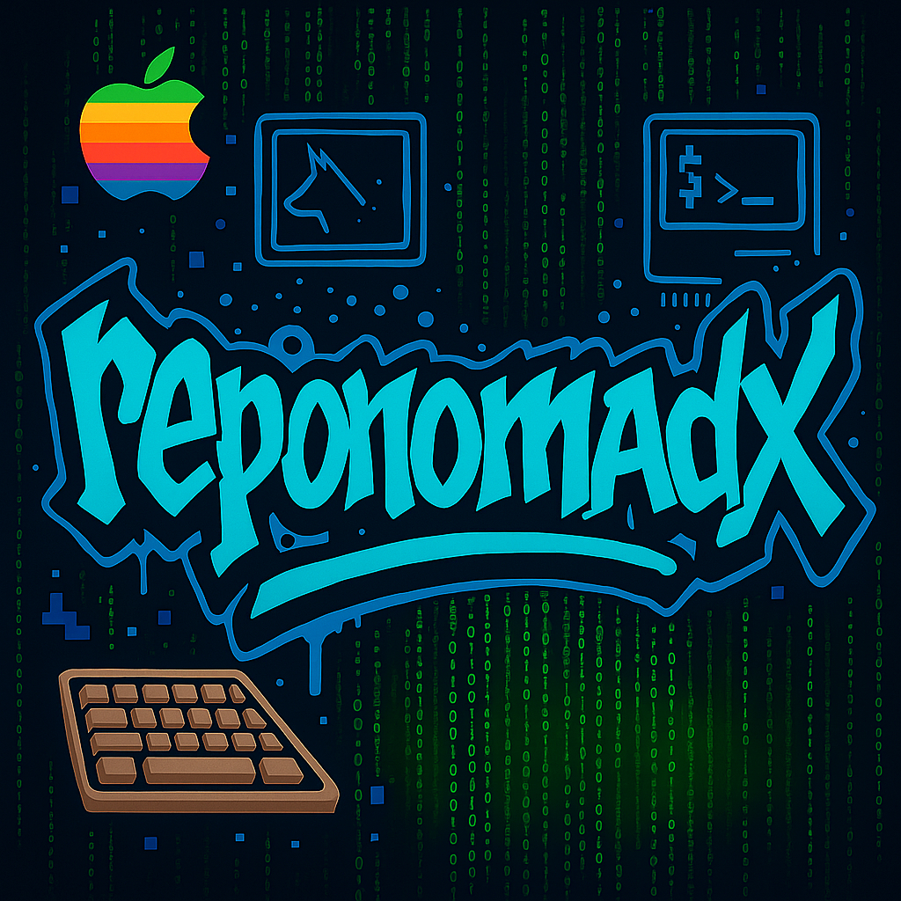
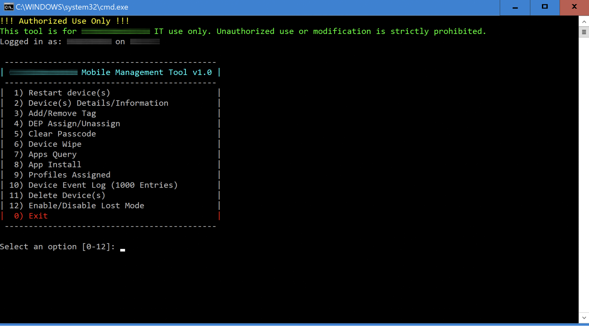

</img>
# 📱 Workspace ONE Mobile Management Tool

A modular PowerShell-based utility for Workspace ONE, built to streamline mobile device administration across large enterprise environments.

Originally developed in Bash for macOS, this tool is now a robust cross-platform suite for Windows, enabling IT teams to:

- Query device details and installed profiles  
- Push or remove apps  
- Reboot, wipe, or trigger OS updates  
- Toggle Lost Mode and clear passcodes  
- Manage tags, Smart Groups, DEP profiles, and more

---

## 🚀 New in v1.3.0

- ✅ **OAuth centralization** — all scripts share one token cache
- ✅ **Color-coded script headers** — Cyan titles for readability
- ✅ **Graceful input handling** — no crashes on missing values
- ✅ **Commented & documented scripts** — perfect for team sharing
- ✅ **14 total scripts** — covering the full WS1 lifecycle

---

## 🛠️ Included Scripts

Each script is standalone, callable individually or via the menu:

| Script | Function |
|--------|----------|
| `menu.ps1` | Interactive CLI menu |
| `Apps.ps1` | List assigned apps for a device |
| `Install App.ps1` | Push assigned apps to a device |
| `Install Purchased App.ps1` | Deploy VPP apps by serial |
| `Profiles.ps1` | Export installed configuration profiles |
| `Device Details.ps1` | Lookup basic device info |
| `Device Event Log.ps1` | Retrieve 1000 recent logs |
| `Restart Device.ps1` | Soft reboot device |
| `Device Wipe.ps1` | Full or enterprise wipe |
| `Update iOS.ps1` | Trigger iOS OS update |
| `LostMode.ps1` | Enable or disable Lost Mode |
| `Clear Passcode.ps1` | Clear passcode from locked device |
| `AddRemove Tag.ps1` | Add/remove device tags |
| `Assign or Unassign DEP.ps1` | Assign/unassign DEP profile |
| `Delete.ps1` | Remove devices from WS1 |

---

## 🔐 OAuth 2.0 Security

All scripts authenticate via **OAuth 2.0** (`client_credentials`) with secure shared token cache:

- Stored centrally:  
  `\\HOST_SERVER\MobileManagementTool\Oauth Token\ws1_token_cache.json`
- Scripts do not include client credentials
- Token reuse built-in; expires every 60 minutes
- Users **do not need write access** to token directory

---

## 🔁 Token Auto-Renewal (Scheduled Task)

Tokens are auto-renewed hourly via Task Scheduler.

| File | Purpose |
|------|---------|
| `OauthRenew.ps1` | PowerShell token refresh script |
| `Oauth - Renew.bat` | Wrapper for scheduled task |
| `WS1 Oauth Token.xml` | Task Scheduler config |
| `refresh.log` | Optional timestamp log file |

> 🛡️ Production-safe: read-only access required

---

## 📂 Output & Logs

Most scripts output to `Downloads` or shared folders:

- `device_profiles.csv`
- `WipedDevices.txt`
- `EventLog_<date>.log`
- `installed_apps_<serial>.csv`

---

## 🧠 Intelligent Behavior

- Scripts **validate input** and exit if missing
- Output is formatted and readable
- Designed for **internal use only** on trusted IT systems

---

## ✅ Requirements

- PowerShell 5.1 or later  
- Workspace ONE UEM API credentials  
- Access to shared script/token folder  
- Windows 10/11 machine (domain-joined recommended)

---

## 🔒 Host Restriction Model

Scripts are designed to run only from **trusted internal endpoints** with shared folder access (`\\HOST_SERVER\MobileManagementTool\`).

This protects token integrity and prevents misuse on personal devices.

---

## 📄 License

MIT License — use, modify, and distribute freely.  
No warranties expressed or implied.
