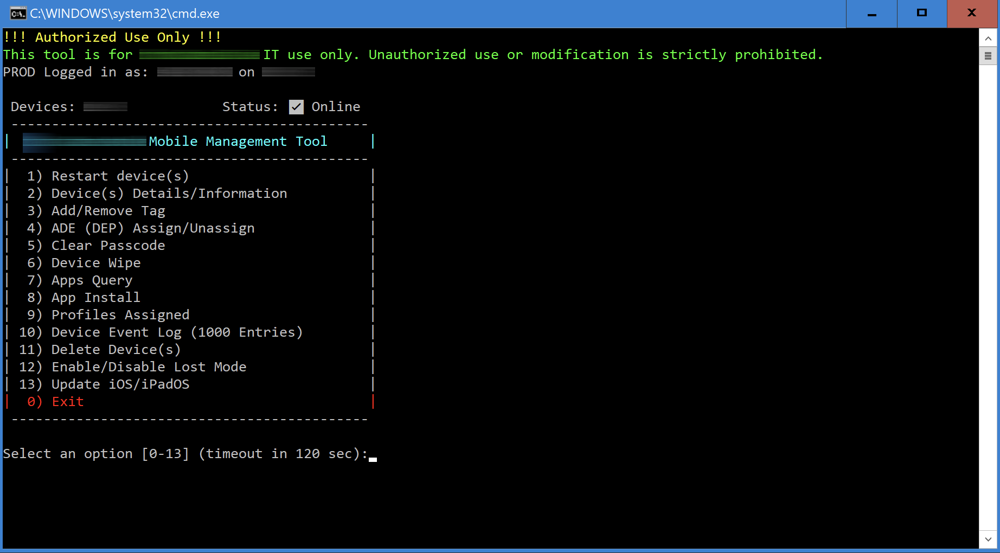

# 📱 Workspace ONE Mobile Management Tool

[](https://docs.microsoft.com/powershell/)
[](https://microsoft.com)
[](LICENSE)
[](https://developer.vmware.com/apis/ws1/)
[](https://github.com/reponomadx/WS1-Mobile-Management-Tool/releases)
[](https://github.com/reponomadx/WS1-Mobile-Management-Tool)



The Workspace ONE Mobile Management Tool is a modular, PowerShell-based utility built to streamline mobile device administration in enterprise environments.

Originally developed in Bash for macOS support workflows, this tool has evolved into a cross-functional PowerShell suite that empowers IT teams to:

- Query device details and installed profiles  
- Reboot or wipe devices  
- Push app installations  
- Toggle Lost Mode  
- Manage tags, DEP profiles, and more  

---

## 🛠️ Included Scripts

Each script is self-contained and callable independently, or via a centralized menu:

| Script | Function |
|--------|----------|
| `menu.ps1` | Interactive CLI menu |
| `Profiles.ps1` | Export installed configuration profiles |
| `Restart Device.ps1` | Reboot devices by serial |
| `Wipe.ps1` | Full or enterprise wipe |
| `Install App.ps1` | Push assigned apps to a device |
| `LostMode.ps1` | Enable or disable Lost Mode |
| `Tag Edit.ps1` | Add or remove device tags |
| `SmartGroup Lookup.ps1` | View Smart Group membership |
| `Assign or Unassign DEP.ps1` | Assign/unassign DEP profiles |
| `EventLog.ps1` | Retrieve 1000 recent device event logs |
| `Delete Devices.ps1` | Remove devices from WS1 by serial or user |
| `Device Details.ps1` | Lookup basic device info |
| `Install Purchased App.ps1` | Deploy VPP apps by serial |
| `OauthRenew.ps1` | PowerShell script for renewing OAuth token |
| `Oauth - Renew.bat` | Wrapper for Task Scheduler token renewal |

Also includes:  
`WS1-Mobile-Management-Tool.bat` → launcher that executes the menu script.

---

## 🚀 Getting Started

1. Clone or download the release from GitHub  
2. Extract the `.zip` to a known location  
3. Update all necessary variables for your environment  
4. Place `WS1-Mobile-Management-Tool.bat` on your desktop (or trusted path)  
5. Double-click to launch the menu system  
6. Select the operation you'd like to perform  

---

## 🔐 Authentication & Security

All API calls are secured using **OAuth 2.0** (`client_credentials` grant type):

- Tokens are requested from:  
  `https://na.uemauth.vmwservices.com/connect/token`
- Cached locally at:  
  `ws1_token_cache.json`
- Automatically refreshed every hour

🔒 **Host-Based Access Restriction**

- The tool is restricted to **trusted IT-managed workstations**
- All scripts depend on internal network paths like:  
  `\HOST_SERVER\MobileManagementTool\`
- `.bat` launcher is not portable and must be used from designated consoles

This prevents misuse from personal machines and secures all token usage to limited endpoints.

---

## 🔁 OAuth Token Auto-Renewal (v1.1.0+)

This module ensures a valid OAuth access token is always available for use with Workspace ONE API scripts. It’s designed to run automatically every hour using **Windows Task Scheduler**.

### 📦 Included Files

| File | Description |
|------|-------------|
| `OauthRenew.ps1` | PowerShell script that checks token age and renews if older than 55 minutes |
| `Oauth - Renew.bat` | Batch script to trigger the PowerShell script and log output |
| `WS1 Oauth Token.xml` | Importable Windows Task Scheduler task (runs hourly on the hour) |
| `refresh.log` | Sample log output (optional, for review/testing) |

### ⚙️ Setup Instructions

#### 1. Edit Credentials in `OauthRenew.ps1`

Replace placeholders with your real values:

```powershell
$clientId = "YOUR_CLIENT_ID"
$clientSecret = "YOUR_CLIENT_SECRET"
$tokenUrl = "https://na.uemauth.workspaceone.com/connect/token"
```

Also confirm the cache path:

```powershell
$tokenCacheFile = "C:\Path\To\Shared\ws1_token_cache.json"
```

> This file stores the token and is used by all Workspace ONE scripts.

#### 2. Import the Scheduled Task

1. Open **Task Scheduler**  
2. Click **“Import Task…”**  
3. Select `WS1 Oauth Token.xml`  
4. Adjust:
   - File paths in the task **Action**
   - User or service account (SYSTEM or admin)
   - Check “Run with highest privileges”

> ✅ This runs **hourly on the hour** to ensure token freshness.

#### 3. Monitor Logs (Optional)

Output is appended to `refresh.log`:

```text
[06/15/2025 12:00:00] Starting token renewal...
[06/15/2025 12:00:03] Done.
```

---

## 📂 Output & Logs

Scripts output to the user’s `Downloads` folder by default or to shared folders such as:

- `device_profiles.csv`
- `WipedDevices.txt`

---

## ✅ System Requirements

- PowerShell 5.1+ (Windows)  
- Workspace ONE API access  
- Admin permissions to target devices  

---

## 🤝 Contributing / Forking

Pull requests are welcome. Please sanitize credentials before pushing updates.  
Issues can be submitted directly on GitHub under the [Issues tab](https://github.com/reponomadx/WS1-Mobile-Management-Tool/issues).

---

## 📢 Publishing & Community

This release is published and verified at:

🔗 [https://github.com/reponomadx/WS1-Mobile-Management-Tool/tree/v1.1.0](https://github.com/reponomadx/WS1-Mobile-Management-Tool/tree/v1.1.0)

If you're viewing this from Reddit or another channel, feel free to reply to the original post with feedback or questions.

---

## 📄 License

MIT License – Free to use, modify, and share. No warranty or guarantee provided.
